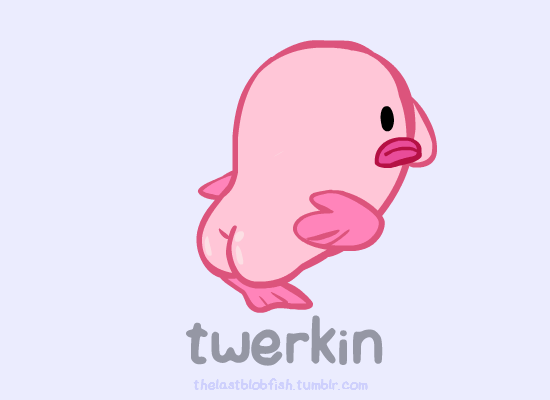

# blobfish

## Overview
An ugly blob container based on protobuf. The project is meant to be an educational PGP-Like tamper-proof file container.


Image courtesy of [Blobby the Blobfish](http://thelastblobfish.tumblr.com/)

## Features
- [x] Container Features
    - [x] Versioned container
    - [x] Multiple blob support
    - [x] Multiple recipient support
- [x] Content Features
    - [x] Blob compression (GZIP)
    - [x] Blob protection (Encryption)
    - [x] Integrity checking (HMAC)
    - [x] Authenticity checking (ECDSA signature)
    - [X] Blob mimetype indicator
    - [x] Blob tagging
    - [x] Blob location path (simulates FS hierarchy)
- [x] Key-Management Features
    - [x] multiple RSA-OAEP symmetric-key protection
    - [ ] Multiple PBKDF2 based symmetric key protection
    - [x] Optional PBKDF2 based master-symmetric-key derivation
- [x] Blob Discovery Features
    - [x] Tag listing
    - [x] Directory listing
    - [x] Open plob by Id
    - [x] Open plob by path
    - [x] List blob by tags
    - [x] List blob by partial/full path
- [ ] BlobPool, a mutable intermediate container
    - [x] Import from blobfish container
    - [ ] Export to blobfish container
    - [ ] Recipient CRUD access
    - [ ] Blob CRUD access
    - [x] Tag CRUD access

## Blobfish Random Facts
- [The Ugliest Animal](https://www.theguardian.com/environment/2013/sep/12/blobfish-world-ugliest-animal)
- [Blobby the Blobfish](http://thelastblobfish.tumblr.com/) 

## Documentation
- [Container Indentification](doc/identification.md)
- [Container Format Definition](src/main/proto/blobfish.proto)
- [Algorithms](doc/ciphersuite.md)
- [Exception Model](doc/exception-model.md)
- [Database](doc/database.md)
- [Usage](doc/usage.md)

## Test Resources
- Keystore password is 'password'
- Testing images taken from [lastblobfish](http://thelastblobfish.tumblr.com/)

## Hexdump example of generated .ugly file

```
$ hexdump -Cv -n 512 target/output.ugly

00000000  08 e8 e6 a5 b3 96 8f db  b3 75 10 01 1a 99 0b 0a  |.........u......|
00000010  ef 03 0a ec 03 30 82 01  e8 30 82 01 6f a0 03 02  |.....0...0..o...|
00000020  01 02 02 04 59 bb da 1f  30 0a 06 08 2a 86 48 ce  |....Y...0...*.H.|
00000030  3d 04 03 02 30 5b 31 11  30 0f 06 03 55 04 0a 0c  |=...0[1.0...U...|
00000040  08 42 6c 6f 62 66 69 73  68 31 0d 30 0b 06 03 55  |.Blobfish1.0...U|
00000050  04 0b 0c 04 54 65 73 74  31 37 30 35 06 03 55 04  |....Test1705..U.|
00000060  03 0c 2e 72 6f 6f 74 63  61 2e 62 6c 6f 62 66 69  |...rootca.blobfi|
00000070  73 68 2e 73 65 63 75 72  69 74 79 2e 65 64 69 70  |sh.security.edip|
00000080  65 72 6d 61 64 69 2e 67  69 74 68 75 62 2e 63 6f  |ermadi.github.co|
00000090  6d 30 20 17 0d 31 37 30  39 31 35 31 33 34 38 31  |m0 ..17091513481|
000000a0  35 5a 18 0f 32 31 31 37  30 39 31 35 31 33 34 38  |5Z..211709151348|
000000b0  31 35 5a 30 5f 31 11 30  0f 06 03 55 04 0a 0c 08  |15Z0_1.0...U....|
000000c0  42 6c 6f 62 66 69 73 68  31 0d 30 0b 06 03 55 04  |Blobfish1.0...U.|
000000d0  0b 0c 04 54 65 73 74 31  3b 30 39 06 03 55 04 03  |...Test1;09..U..|
000000e0  0c 32 73 65 6e 64 65 72  2e 73 69 67 2e 62 6c 6f  |.2sender.sig.blo|
000000f0  62 66 69 73 68 2e 73 65  63 75 72 69 74 79 2e 65  |bfish.security.e|
00000100  64 69 70 65 72 6d 61 64  69 2e 67 69 74 68 75 62  |dipermadi.github|
00000110  2e 63 6f 6d 30 76 30 10  06 07 2a 86 48 ce 3d 02  |.com0v0...*.H.=.|
00000120  01 06 05 2b 81 04 00 22  03 62 00 04 68 2a a6 64  |...+...".b..h*.d|
00000130  d7 d5 b1 11 50 c6 bc 28  8b 20 e4 37 27 d0 59 13  |....P..(. .7'.Y.|
00000140  25 4d 35 09 55 18 41 30  81 b7 67 74 32 5b 1d 3d  |%M5.U.A0..gt2[.=|
00000150  6a fd 1e 50 0f ab 64 be  17 72 70 57 49 6c 75 60  |j..P..d..rpWIlu`|
00000160  93 ae f7 c5 1a 5e 82 f2  3e c2 fb a0 04 75 74 7a  |.....^..>....utz|
00000170  27 b6 1a e9 9b 3e 1b 99  1d d4 62 96 e6 47 53 65  |'....>....b..GSe|
00000180  ad b0 ac 9c b6 ca eb 3d  d2 21 65 93 30 0a 06 08  |.......=.!e.0...|
00000190  2a 86 48 ce 3d 04 03 02  03 67 00 30 64 02 30 6c  |*.H.=....g.0d.0l|
000001a0  75 82 32 d4 9b 82 c5 3c  d5 aa c1 17 e9 b3 e1 d5  |u.2....<........|
000001b0  df d6 fa c6 43 e1 5a 79  1b cd 2f 72 ae a9 f0 8a  |....C.Zy../r....|
000001c0  e9 42 03 39 fb ba d3 a8  67 ef ce f5 85 91 42 02  |.B.9....g.....B.|
000001d0  30 39 99 05 49 5c 79 25  ad c7 23 43 c0 32 6b a4  |09..I\y%..#C.2k.|
000001e0  1a 5c a2 8d c3 a2 dc f2  fc aa 26 ac 4b bb f6 49  |.\........&.K..I|
000001f0  bc 8c 90 8d 43 75 30 12  78 96 a8 11 1a cc bd 36  |....Cu0.x......6|
00000200
```